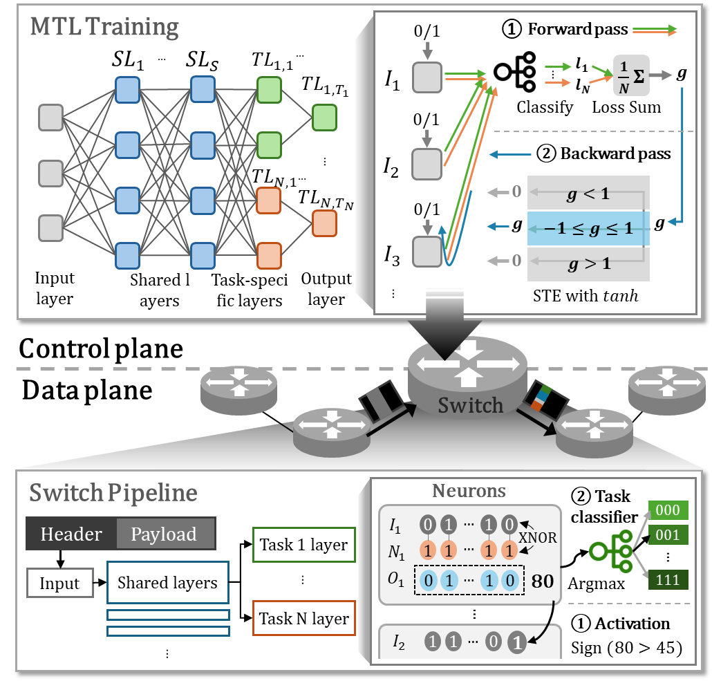

# MALOI: Multi-Task-Aware Low-Overhead In-Network Inference using Programmable Switch

## Overview of MALOI

<p align="center">


MALOI applies multi-task learning (MTL) in programmable data planes (PDP) to efficiently handle multiple inference tasks with minimal overhead (e.g., memory and processing delay). By sharing hidden layer parameters and selecting essential features, MALOI reduces memory usage and inference delay while maintaining comparable accuracy.

## Folder Structure

### `p4src`
Contains P4 code implementing MALOI’s in-network inference logic. The files define the data plane processing for multi-task classification using XNOR-based BNNs.

### `rule`
Stores task-specific model weights and lookup tables used for inference. These rules guide the execution of MALOI within the switch pipeline.

### `packets`
Handles core networking functionalities, including:
- Packet transmission and reception.
- Mininet-based testbed setup.
- Logging and result collection.

### `results`
Contains inference results, including per-task accuracy and latency measurements. These results are processed for performance evaluation and comparison with software-based baselines.

## Dependencies
To run MARLOI, the following dependencies must be installed:
- **p4c**: [https://github.com/p4lang/p4c](https://github.com/p4lang/p4c)
- **Bmv2**: [https://github.com/p4lang/behavioral-model](https://github.com/p4lang/behavioral-model)
- **Mininet**: [https://github.com/mininet/mininet](https://github.com/mininet/mininet)

## Simulation
For each classification data in a packet, inference switch simultaneously conducts inference for 5 classification tasks (i.e., Workclass, Marital-status, Sex, Capital-loss, Hours-per-week).

This repository includes the following three in-network inference schemes. 
- STL w/ 15 features (P4-BNN)
- MTL w/ 15 features (MALOI)
- MTL w/ 11 features (MALOI)

## Execution Steps
Use the following command to compile and deploy MALOI on the programmable switch:

### Clone Repository
```bash
git clone https://github.com/keemeew/MALOI
```
---
### Compile and Run P4 Programs [Terminal 1]

```bash
cd p4src
```
*STL 15 features*
```bash
p4c-bm2-ss --target bmv2 --arch v1model -o stl_f15_t5.json stl_f15_t5.p4
```
*MTL 15 features*
```bash
p4c-bm2-ss --target bmv2 --arch v1model -o mtl_f15_t5.json mtl_f15_t5.p4
```
*MTL 11 features*
```bash
p4c-bm2-ss --target bmv2 --arch v1model -o mtl_f11_t5.json mtl_f11_t5.p4
```
### Execute the Switch Program [Terminal 2]

```bash
cd p4src
```
*STL 15 features*
```bash
sudo simple_switch --log-console -i 0@veth0 -i 2@veth2 --thrift-port 9090 stl_f15_t5.json
```
*MTL 15 features*
```bash
sudo simple_switch --log-console -i 0@veth0 -i 2@veth2 --thrift-port 9090 mtl_f15_t5.json
```
*MTL 11 features*
```bash
sudo simple_switch --log-console -i 0@veth0 -i 2@veth2 --thrift-port 9090 mtl_f11_t5.json
```

### Load Model Weights [Terminal 3]

```bash
cd ./p4src/rule
```
*STL 15 features*
```bash
/home/mnc/mnc/behavioral-model/targets/simple_switch/simple_switch_CLI --thrift-port 9090 < ~/p4src/rule/stl_f15_t5.txt
```
*MTL 15 features*
```bash
/home/mnc/mnc/behavioral-model/targets/simple_switch/simple_switch_CLI --thrift-port 9090 < ~/p4src/rule/mtl_f15_t5.txt
```
*MTL 11 features*
```bash
/home/mnc/mnc/behavioral-model/targets/simple_switch/simple_switch_CLI --thrift-port 9090 < ~/p4src/rule/mtl_f11_t5.txt
```

### Start Packet Transmission and Reception

```bash
cd packets
```
*STL 15 features*
```bash
[Terminal 4]
sudo python3 receive.py --mode stl --f 15 --t 5
[Terminal 5]
sudo python3 send.py --mode stl --f 15 --t 5
```
*MTL 15 features*
```bash
[Terminal 4]
sudo python3 receive.py --mode mtl --f 15 --t 5
[Terminal 5]
sudo python3 send.py --mode mtl --f 15 --t 5
```
*MTL 11 features*
```bash
[Terminal 4]
sudo python3 receive.py --mode mtl --f 11 --t 5
[Terminal 5]
sudo python3 send.py --mode mtl --f 11 --t 5
```
