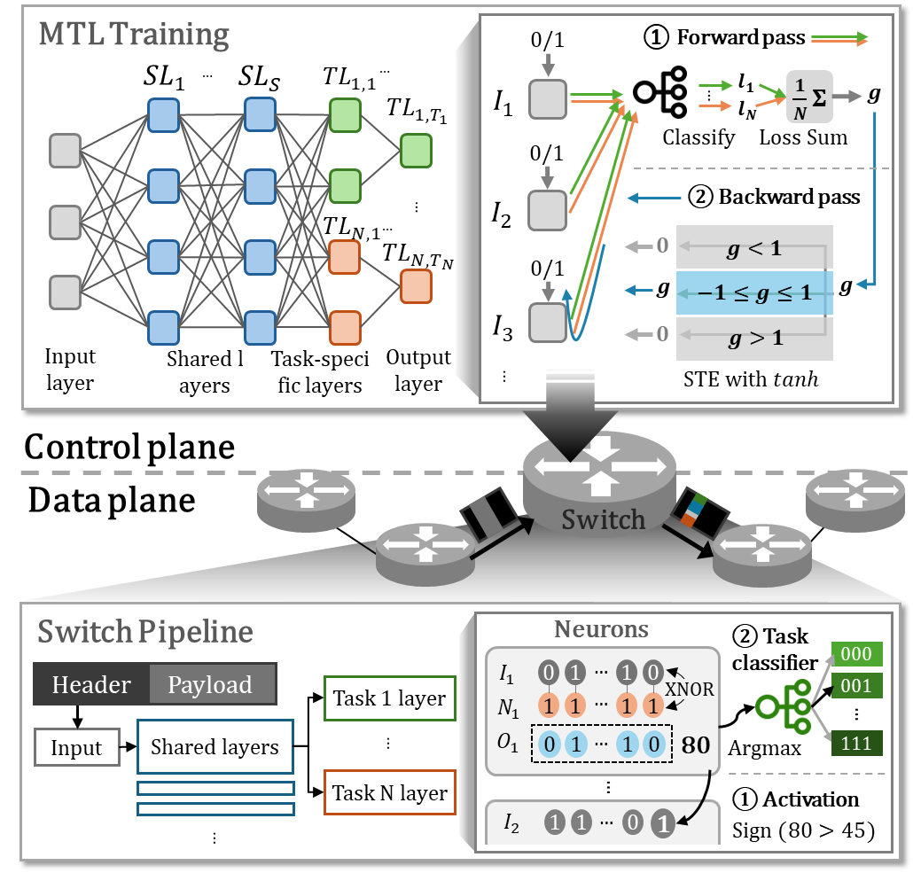
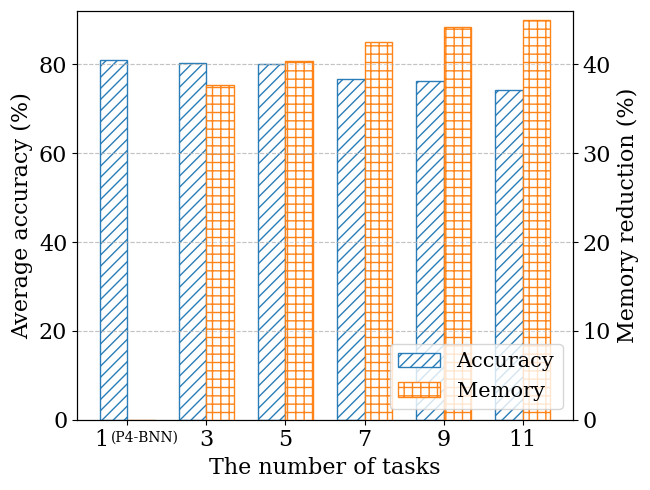
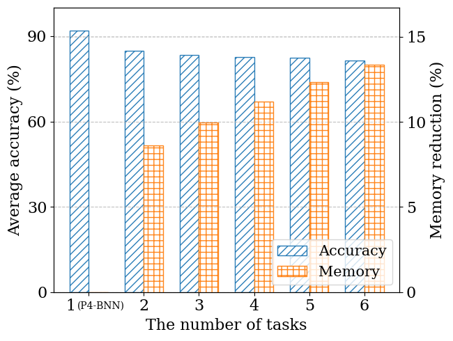
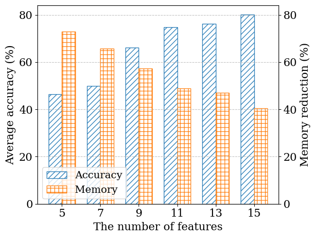
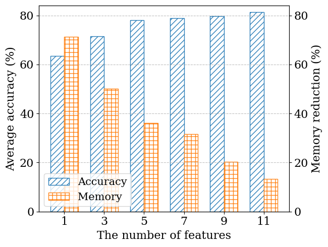
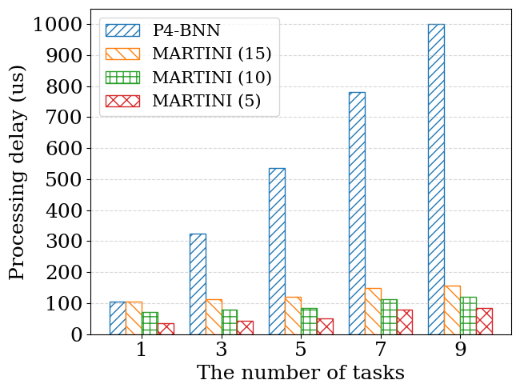

# MALOI: Multi-Task-Aware Low-Overhead In-Network Inference using Programmable Switch

## Overview of MALOI

MALOI applies multi-task learning (MTL) in programmable data planes (PDP) to efficiently handle multiple inference tasks with minimal overhead (e.g., memory and processing delay). Furthermore, MALOI selects a part of essential features and compresses the inference model accordingly. By sharing hidden layer parameters and selecting essential features, MALOI reduces memory usage and inference delay while maintaining comparable accuracy. 

## Evaluation Results

We conducted tests on an Wedge100BF-32X Tofino switch. Memory usage and processing delay correspond to # of SRAM blocks and end-to-end delay to escape recirculation in the switch, respectively. We considered two datasets, Census Income and ISCXVPN2016 + ISCXTor2016, for real-world scenario and network scenario, respectively.

### Accuracy and Memory Reduction According to # of Tasks 
| Census Income | ISCX VPN and Tor | 
|------------------|------------------|
|  |  | 

### Accuracy and Memory Reduction According to # of Features 
| Census Income | ISCX VPN and Tor | 
|------------------|------------------|
|  |  | 

### Processing Delays 
| Census Income | 
|------------------|
|  |

